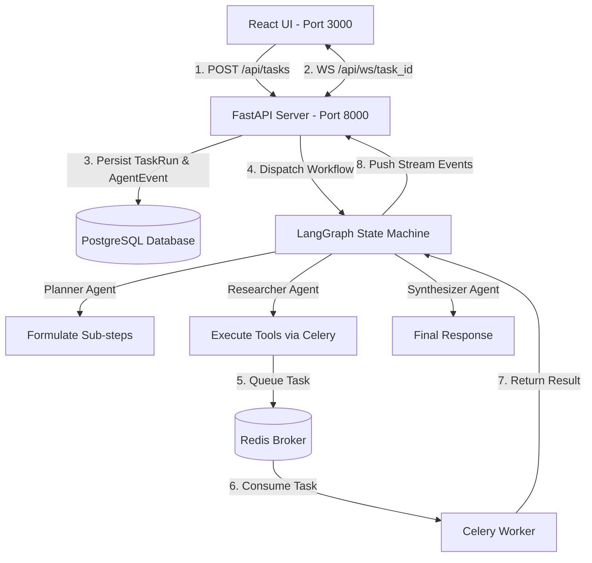

# Stateful Multi-Agent AI Orchestration System

A stateful, auditable multi-agent AI system built using **LangGraph**, **FastAPI**, **Celery + Redis**, **PostgreSQL**, and **React**.

---

## 🌟 Architecture Overview



---

## 🚀 Features

- **Stateful Multi-Agent Orchestration**: LangGraph state machine directing **Planner**, **Researcher**, and **Synthesizer** agents.
- **Pydantic-Validated Custom Tools**:
  - `web_search_tool`: Brave / Web search integration with fallback.
  - `weather_tool`: OpenWeatherMap integration with fallback.
  - `data_analysis_tool`: Arithmetic calculation, news headlines, and statistical trends.
- **Asynchronous Celery Offloading**: Long-running tool executions offloaded to Celery workers backed by Redis.
- **Full Database Audit Log**: Every thought, plan, tool call, and result recorded in PostgreSQL (`task_runs` and `agent_events`).
- **Real-Time Streaming via WebSockets**: Live event streaming to a modern React UI with interactive activity timeline.

---

## 🛠️ Quickstart Guide

### Prerequisites
- Docker & Docker Compose installed.

### Spin Up the Entire System with Single Command

```bash
docker compose up --build
```

Access services:
- **React Frontend UI**: [http://localhost:3000](http://localhost:3000)
- **FastAPI REST API & Docs**: [http://localhost:8000/docs](http://localhost:8000/docs)
- **PostgreSQL DB**: `localhost:5432` (`orchestrator_db`)
- **Redis Broker**: `localhost:6379`

---

## 📡 REST API & WebSocket Endpoints

### 1. Initiate Task
- **`POST /api/tasks`**
  ```json
  {
    "prompt": "What is the current weather in Tokyo, and based on that, what should I pack?"
  }
  ```
- **Response**:
  ```json
  {
    "task_id": "c9b8a7f6-1234-5678-9abc-def012345678",
    "status": "PENDING"
  }
  ```

### 2. Real-Time Event Stream
- **`WS /api/ws/{task_id}`**
  - Streams real-time JSON events:
  ```json
  {
    "task_id": "c9b8a7f6-1234-5678-9abc-def012345678",
    "event_type": "AGENT_THOUGHT",
    "agent": "Planner",
    "payload": {
      "thought": "Formulated a 3-step execution plan.",
      "plan": [
        "Look up location weather conditions using Weather Tool",
        "Search relevant recommendations",
        "Synthesize final recommendations"
      ]
    },
    "timestamp": "2026-08-11T21:00:00Z"
  }
  ```

### 3. Retrieve Task Details
- **`GET /api/tasks/{task_id}`**

---

## 📖 System Evaluation & Design

For complete details on orchestration design, agent prompts, and Pydantic tool schemas, refer to [EVALUATION.md](file:///d:/GPP/task33/Multi-Agent-Orchestration-System/EVALUATION.md).
