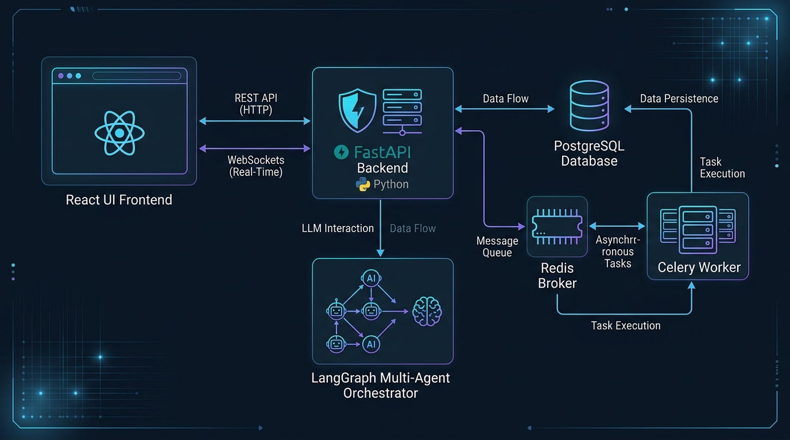
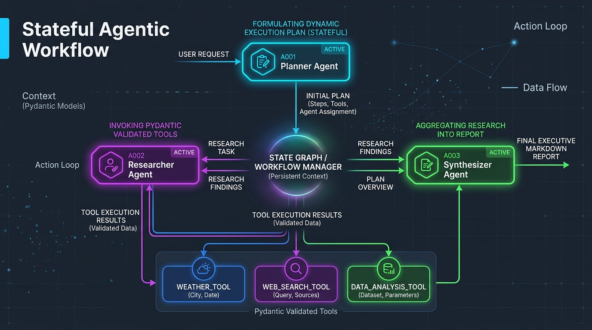
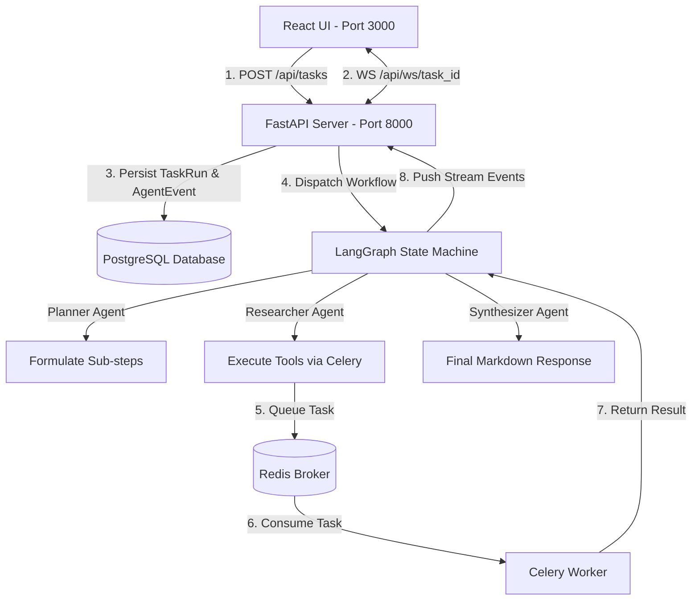

# 🤖 Stateful Multi-Agent AI Orchestration System

[](https://fastapi.tiangolo.com/)
[](https://python.langchain.com/docs/langgraph)
[](https://reactjs.org/)
[](https://www.postgresql.org/)
[](https://redis.io/)
[](https://docs.celeryq.dev/)
[](https://www.docker.com/)

A production-grade, stateful, and fully auditable **Multi-Agent AI Orchestration System** built using **LangGraph**, **FastAPI**, **Celery + Redis**, **PostgreSQL**, and **React**. 

This system enables autonomous AI agents (**Planner**, **Researcher**, and **Synthesizer**) to break down complex multi-step user prompts, execute typed custom tools asynchronously, log full thought-and-tool state histories to PostgreSQL, and stream real-time execution events directly to a web dashboard via WebSockets.

---

## 🖼️ System Architecture & Visual Overview

### 1. High-Level Architecture Diagram


### 2. Stateful Agentic Workflow Diagram


---

## 🌟 Key Features & Capabilities

- **Stateful Agentic Graph (`LangGraph`)**: Replaces simple prompt-response loops with a structured `StateGraph` that manages dynamic transitions between three distinct agent roles:
  1. 🎯 **Planner Agent**: Analyzes user intent and formulates a 2-to-3 step execution strategy.
  2. 🔍 **Researcher Agent**: Iteratively selects and executes specialized Pydantic-validated tools.
  3. 📝 **Synthesizer Agent**: Aggregates all empirical findings into a structured Executive Report.
- **Pydantic-Validated Custom Tooling**:
  - ☀️ `weather_tool`: Weather forecasts and atmospheric conditions with metric/imperial unit support.
  - 🧮 `data_analysis_tool`: Safe mathematical evaluation, financial trend calculations, and news extraction.
  - 🌐 `web_search_tool`: Web research integration with domain fallback handling.
- **Asynchronous Task Offloading**: Long-running tool executions offloaded asynchronously to background Celery workers via Redis message broker.
- **Production Auditability & State Persistence**: Every agent thought, tool payload, and result logged to PostgreSQL (`task_runs` and `agent_events` tables).
- **Real-Time WebSocket Event Streaming**: Live event streaming to a React UI dashboard with a trace timeline and Markdown report generator.

---

## 📊 End-to-End System Data Flow



---

## 📂 Project Directory Structure

```text
Multi-Agent-Orchestration-System/
├── assets/                          # Visual architecture diagrams and documentation graphics
│   ├── architecture_overview.jpg    # System architectural overview diagram
│   └── multi_agent_workflow.jpg     # Agent state graph workflow diagram
├── backend/
│   ├── app/
│   │   ├── agents/                  # LangGraph state machine, agent nodes, & state schema
│   │   │   ├── state.py             # AgentState TypedDict schema definition
│   │   │   ├── nodes.py             # Planner, Researcher, and Synthesizer node implementations
│   │   │   ├── graph.py             # LangGraph state graph compilation & routing
│   │   │   ├── prompts.py           # System prompts for all agents
│   │   │   └── events.py            # Event logger for DB persistence & WebSockets
│   │   ├── api/                     # FastAPI routes & WebSocket endpoints
│   │   │   ├── endpoints.py         # REST API (/api/tasks, /api/tasks/{id})
│   │   │   └── websockets.py        # Real-time WebSocket connection manager (/api/ws/{id})
│   │   ├── db/                      # Database configuration & SQLAlchemy models
│   │   │   ├── database.py          # PostgreSQL session management & engine
│   │   │   └── models.py            # TaskRun & AgentEvent database models
│   │   ├── tasks/                   # Celery asynchronous background tasks
│   │   │   └── tasks.py             # Celery tool task definitions (@celery_app.task)
│   │   ├── tools/                   # Pydantic-validated custom tool modules
│   │   │   ├── weather.py           # weather_tool implementation
│   │   │   ├── data_analyzer.py     # data_analysis_tool (math, trends, news)
│   │   │   └── web_search.py        # web_search_tool implementation
│   │   ├── worker/                  # Celery worker application configuration
│   │   │   └── celery_app.py        # Celery app initialization with Redis broker
│   │   ├── config.py                # Environment configuration settings
│   │   └── main.py                  # FastAPI application entry point
│   ├── Dockerfile                   # Backend Docker container specification
│   └── requirements.txt             # Python dependencies
├── frontend/                        # React + TypeScript UI Frontend
│   ├── src/
│   │   ├── components/              # UI Navbar, TaskForm, Timeline, & FinalResultCard
│   │   ├── hooks/                   # useAgentWebSocket hook for live streaming
│   │   ├── App.tsx                  # Main React application shell
│   │   └── types.ts                 # TypeScript type definitions
│   └── Dockerfile                   # Frontend Docker container specification
├── docker-compose.yml               # Multi-container orchestrator configuration
├── EVALUATION.md                    # Deep-dive system evaluation & comparison docs
└── README.md                        # Primary project documentation
```

---

## 🛠️ Quickstart Guide

### Prerequisites
- [Docker Desktop](https://www.docker.com/products/docker-desktop/) installed on your machine.

### Spin Up the Complete Stack (Single Command)

```bash
docker compose up --build
```

### Access System Services

| Service | Location / URL | Description |
| :--- | :--- | :--- |
| **React UI Dashboard** | [http://localhost:3000](http://localhost:3000) | Main user interface with real-time trace timeline |
| **FastAPI REST API Docs** | [http://localhost:8000/docs](http://localhost:8000/docs) | Swagger API documentation & OpenAPI schema |
| **PostgreSQL Database** | `localhost:5432` (`orchestrator_db`) | Audit persistence store (`task_runs` & `agent_events`) |
| **Redis Message Broker** | `localhost:6379` | Celery task queue & event broker |

---

## 📡 REST API & WebSocket Specifications

### 1. Initiate Workflow Task
- **Endpoint**: `POST /api/tasks`
- **Request Body**:
  ```json
  {
    "prompt": "What is the current weather in Tokyo, and based on that, what should I pack for a 3-day trip?"
  }
  ```
- **Response** (`201 Created`):
  ```json
  {
    "task_id": "c9b8a7f6-1234-5678-9abc-def012345678",
    "status": "PENDING"
  }
  ```

### 2. Real-Time WebSocket Event Stream
- **Endpoint**: `WS /api/ws/{task_id}`
- **Sample Event Payload**:
  ```json
  {
    "task_id": "c9b8a7f6-1234-5678-9abc-def012345678",
    "event_type": "AGENT_THOUGHT",
    "agent": "Planner",
    "payload": {
      "thought": "Formulated a 3-step dynamic execution plan.",
      "plan": [
        "Look up meteorological conditions for Tokyo using Weather Tool",
        "Search local activity recommendations for Tokyo",
        "Synthesize custom packing strategy for Tokyo"
      ]
    },
    "timestamp": "2026-09-09T18:00:00Z"
  }
  ```

### 3. Retrieve Task Audit History
- **Endpoint**: `GET /api/tasks/{task_id}`
- **Response**: Full task record including prompt, status, final output, and ordered event sequence.

---

## 💾 PostgreSQL Audit Database Schema

```sql
-- Macro Task Runs Table
CREATE TABLE task_runs (
    id VARCHAR PRIMARY KEY,
    prompt TEXT NOT NULL,
    status VARCHAR NOT NULL,
    final_result TEXT,
    created_at TIMESTAMP DEFAULT CURRENT_TIMESTAMP,
    updated_at TIMESTAMP DEFAULT CURRENT_TIMESTAMP
);

-- Micro Agent Life Cycle Events Table
CREATE TABLE agent_events (
    id VARCHAR PRIMARY KEY,
    task_id VARCHAR REFERENCES task_runs(id) ON DELETE CASCADE,
    agent_name VARCHAR NOT NULL,
    event_type VARCHAR NOT NULL,
    payload JSONB NOT NULL,
    timestamp TIMESTAMP DEFAULT CURRENT_TIMESTAMP
);
```

---

## 📖 Deep-Dive System Evaluation

For complete architectural comparisons between **LangGraph vs. AutoGen**, detailed agent prompts, and Pydantic tool schema definitions, refer to [EVALUATION.md](EVALUATION.md).
